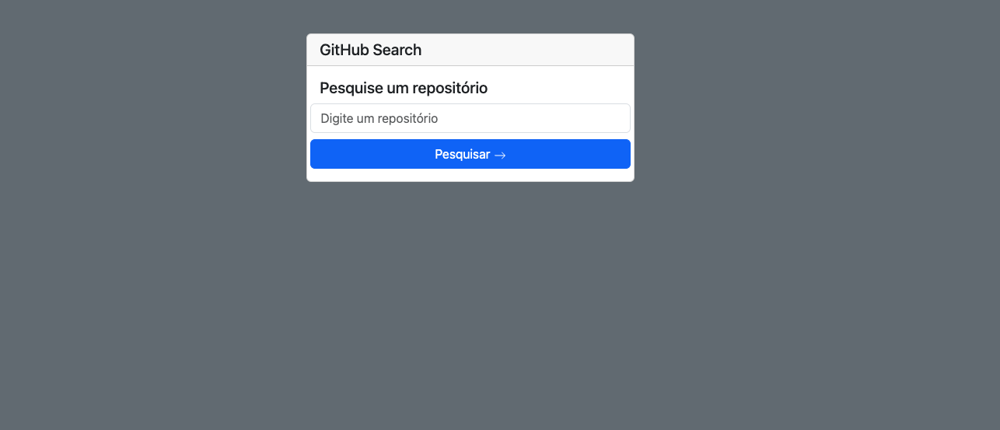
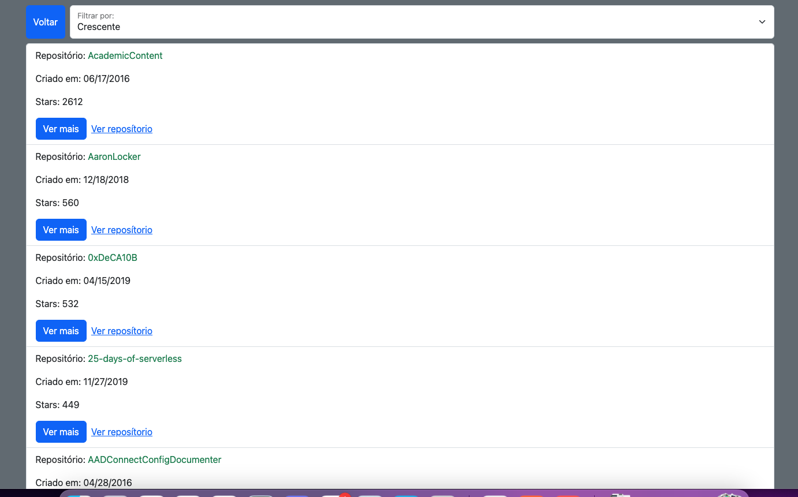

# Github Searches

Essa é uma aplicação de pesquisa na API do Github

# Demonstração

;
;
;
;

**🎛 Setup**

-   [Development](#development)
-   [Executando o app](#running-the-app)
-   [Internacionalização](#internationalization)

## Development

### Environment Setup

Precisamos criar um `.env`, veja o `.env.example` para o formato dos arquivos a ser salvo.

## Executando o app

Para executar o aplicativo no ambiente de desenvolvimento

Primeiramente atualize as bibliotecas com

```sh
yarn `ou` npm install
```

então

```sh
  yarn dev `ou` npm run dev
```

## Test Vitest

Os testes são escritos em arquivos .test.ts no diretório tests/. Execute

```sh
  yarn test `ou` npm run test
```

## Building

```sh
  yarn build `ou` npm run build
```

## Internacionalização

Usamos [i18next](https://www.i18next.com/) para traduzir o aplicativo em qualquer idioma que desejarmos. Todas as traduções são armazenadas na pasta [assets](/translations).

## Diretório de componentes

O diretório de componentes conterá todos os componentes que serão usados em mais de um lugar, principais e secundários, todos os componentes reutilizáveis do projeto devem estar aqui para serem importados como `@components/NameOfComponent`.

Componente que serão utilizados apenas em uma única tela, deverá estar na pasta componente dentro da pasta stack de cada tela. Exemplo: `@screens/HomeStack/components`

## Padrão da pasta

**Cada componente criado deve estar dentro de uma pasta.**

-   Primeiro exemplo:
    Digamos que eu queira criar um componente CustomText. Este exemplo deve ser criado na seguinte estrutura:

```shell
|-- components
    |-- CustomText
        |-- index.ts # Isso exportará o componente
        |-- CustomText.component.tsx # O padrão de exportação do componente
```

-   Segundo exemplo:
    Digamos que estou criando um componente SkeletonLoading. Mas já tenho no meu projeto um componente BarLoading. Os dois componentes estão relacionados ao assunto do carregamento. Neste caso, nossa pasta pai chamará `Loadings` e conterá os componentes:

```shell
|-- components
    |-- Loadings
        |-- index.ts # Isso exportará todos os componentes
        |-- SkeletonLoading.component.tsx # O padrão de exportação do componente
        |-- BarLoading.component.tsx # O padrão de exportação do componente
```

## Importando componente para tela ou qualquer outro componente externo

Com a estrutura que temos acima, verifique sempre se está importando do local correto.

&check; _certo_:

```js
import { component } from "@components/exampleGroup";
```

&cross; _errado_:

```js
import { component } from "@components/exampleGroup/children/file.component";
```

Além disso, nunca importe o padrão de um componente, pois isso permite que você escreva o nome que desejar e, para manter a consistência, devemos sempre importar das exportações nomeadas.

&check; _certo_:

```js
import { NomeExato } from "@components/exampleGroup";
```

&cross; _errado_:

```js
import Qualquer_Nome_Que_Eu_Queira from "@components/exampleGroup";
```

Além disso, hooks devem ser criadas nas pasta relativas ao seu uso, caso seja para services, deve contem uma pasta `src/services/hooks`, caso seja para components `src/components/hooks`
